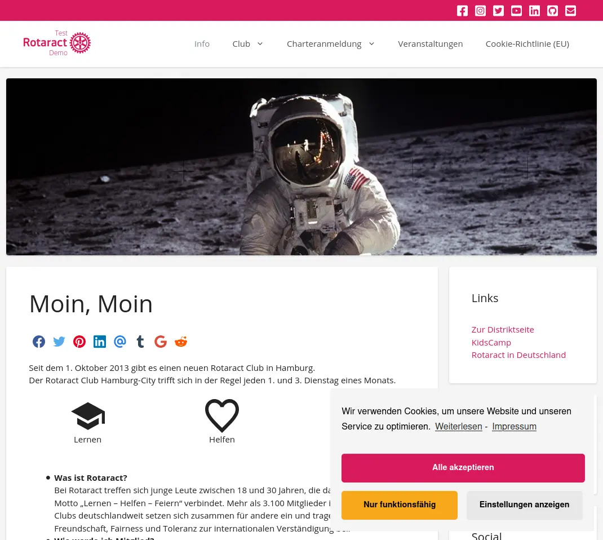

# Rotaract Family

A lightweight Wordpress theme for the world of Rotaract

## Installation

This theme is already available for German Rotaract clubs, districts and projects. Beyond that it is easy to setup on any Wordpress project.

### In Rotaract Hosting (Germany only)

If you get a new website this theme will already be activated by default. Enjoy!

You can activate it on an existing website in your Wordpress backend in **Design/Theme**.

### In your own Wordpress project

1. Download [latest zip file](https://github.com/rotaract/rotaract-family/releases/latest).
2. Use the manual theme installation within your backend and choose the downloaded file.

## Customizing

After setup you should open the customizer and set your theme options.
